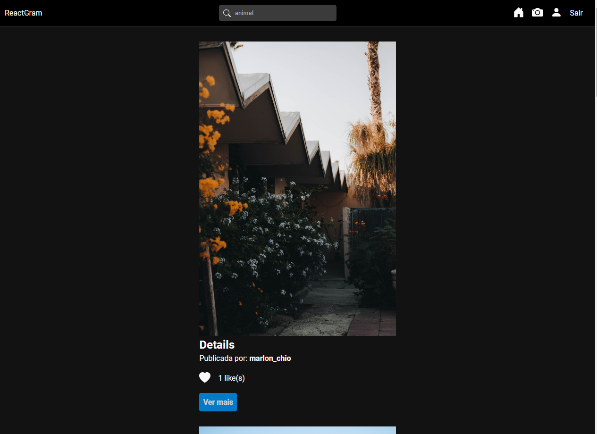
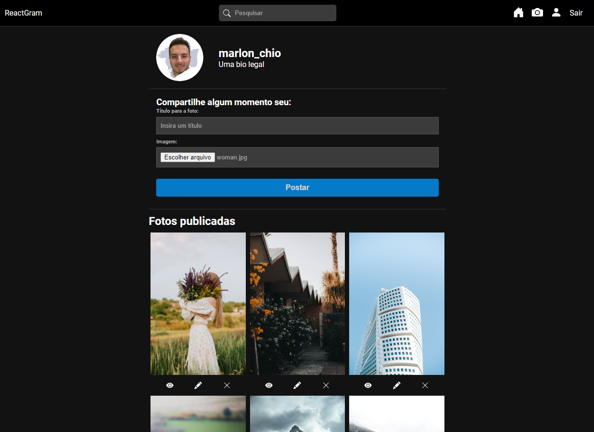
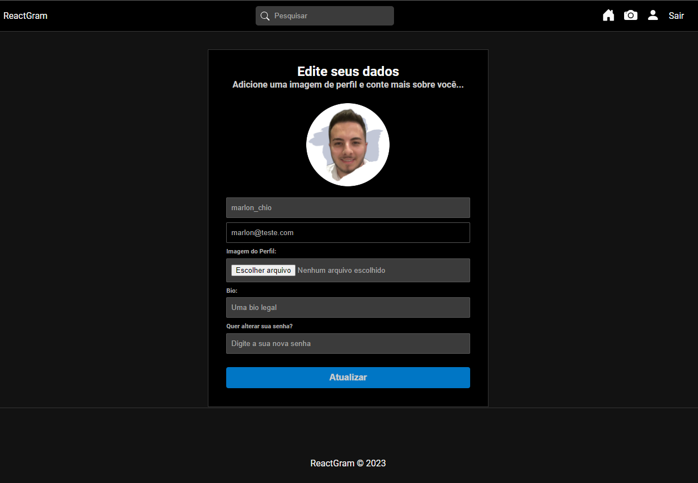

<h1 align="center">ReactGram</h1>

<p align="center">
  <a href="#-tecnologias">Tecnologias</a>&nbsp;&nbsp;&nbsp;|&nbsp;&nbsp;&nbsp;
  <a href="#-iniciando-a-aplicação">Iniciando</a>&nbsp;&nbsp;&nbsp;|&nbsp;&nbsp;&nbsp;
  <a href="#-projeto">Projeto</a>&nbsp;&nbsp;&nbsp;|&nbsp;&nbsp;&nbsp;
  <a href="#memo-licença">Licença</a>&nbsp;&nbsp;&nbsp;|&nbsp;&nbsp;&nbsp;
  <a href="#-contato">Contato</a>
</p>

<p align="center">
  
</p>

<br>

<p align="center">
  
</p>
<p align="center">
  
</p>
<p align="center">
  
</p>

## 🚀 Tecnologias

Esse projeto foi desenvolvido com as seguintes tecnologias:

Frontend:

- **React**
- **Redux**
- **React Router Dom**
- **React Icons**

Backend:

- **Node**
- **MongoDB**
- **Express**
- **Express Validator**
- **Cors**
- **Multer**
- **JWT Token**

## :car: Iniciando a aplicação

Baixe o repositório com git clone e entre nas pastas web e server para instalar as dependências.<br/>

```bash
$ git clone https://github.com/MarlonChi/reactgram
```

```bash
$ cd server
$ npm install
$ npm run server
```

```bash
$ cd web
$ npm install
$ npm run dev
```

## 💻 Projeto

ReactGram é um projeto desenvolvido para praticar React, seus hooks, custom hooks, redux e tecnologias de backend como Node e outras libs. É utilizado MongoDb para database possui autenticação de usuários além de diversas páginas como Home, Perfil, Search, nas fotos o usuário pode interagir com posts de outras pessoas curtindo e comentando...
<br/>

## :memo: Licença

Esse projeto está sob a [licença MIT](LICENSE).

## :email: Contato

## E-mail: [**marlonchiodelli@hotmail.com**](mailto:marlonchiodelli@hotmail.com)
